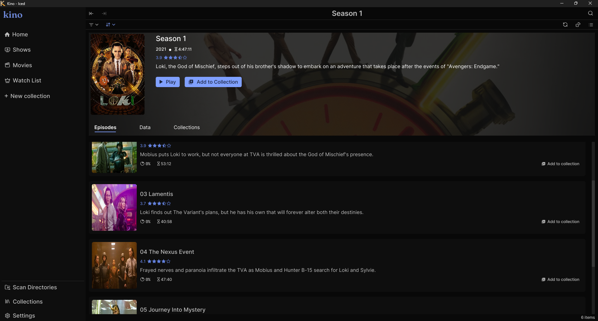
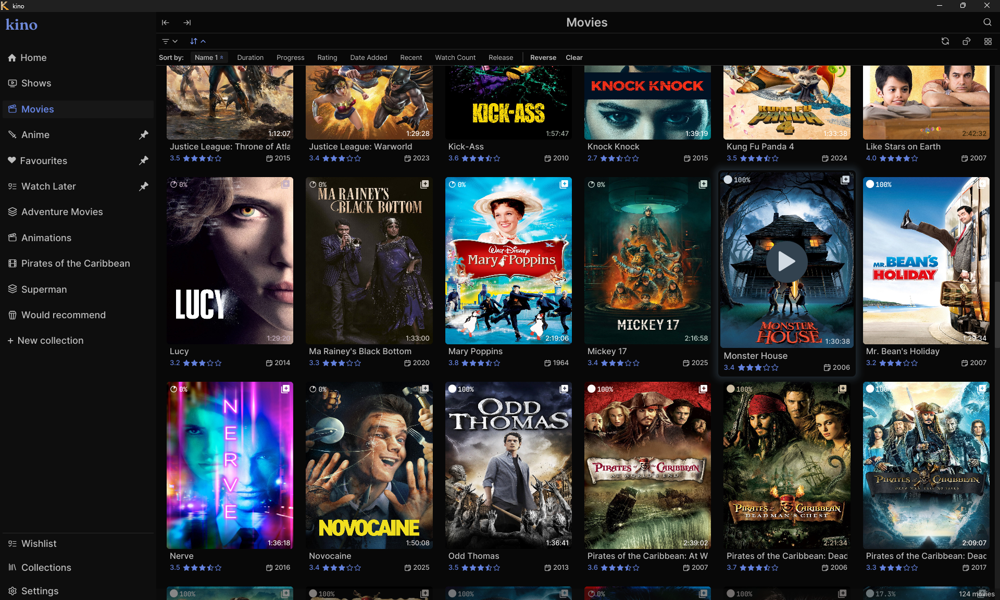

<div align="center">
    

# Kino

A local movie and TV show library manager and player with support for curated collections.





See the [showcase directory](resources/images/showcase) for more images.

</div>

## Features

- Scan and index any number of local directories for media files

- Fast search across your library with filtering and sorting options

- Automatic collections with customizable rules and smart population

- Playlist creation, temporary selection mode, and playlist saving

- Comments, notes, and metadata management for videos

- Wishlist support for tracking media to watch later

- Fetch extra metadata from use selected sources

- Fully customizable keybindings for actions throughout the app

Take a look at [the documentation](/resources/docs/README.md) for more.

## Installation

Note that Kino relies on Gstreamer for video playback. You can install gstreamer by following the instructions [here](https://github.com/sdroege/gstreamer-rs?tab=readme-ov-file#installation)

### From Package

Pre-built packages for can be found on the [releases](https://github.com/EmmanuelDodoo/kino/releases) page

### With Cargo

```
cargo install --git https://github.com/EmmanuelDodoo/kino.git
```

### From Souce

```
git clone https://github.com/EmmanuelDodoo/kino.git
cd kino
cargo build --release
./target/release/kino
```

## Acknowledgement

Much thanks to

- [jazzfool](https://github.com/jazzfool) for both their work on [iced_video_player](https://github.com/jazzfool/iced_video_player) and [jangal](https://github.com/jazzfool/jangal) which provided some inspiration.

- [Iced](https://github.com/iced-rs/iced)

## Feedback

Feel free to leave any feedback via an issue or pull request.
