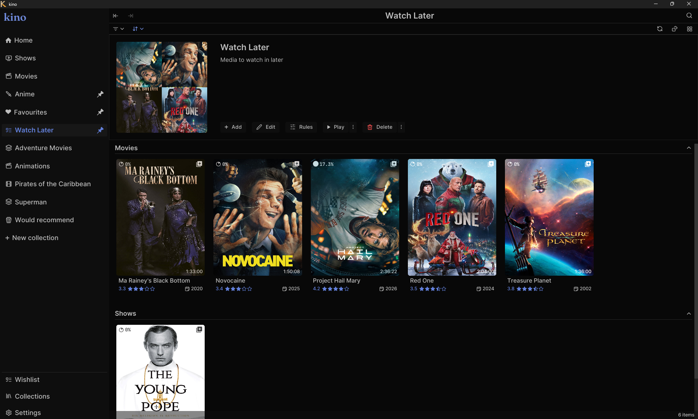
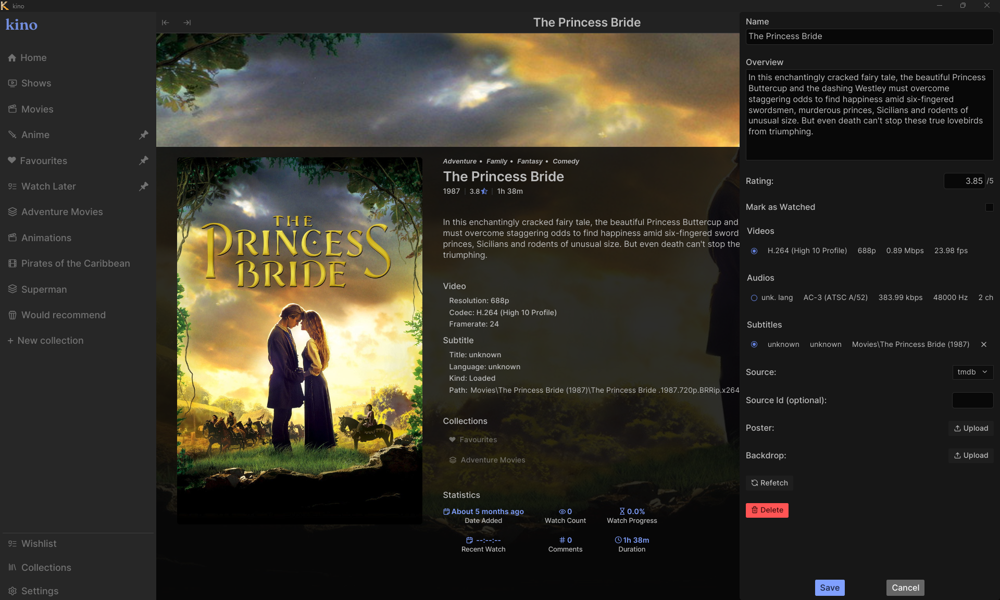
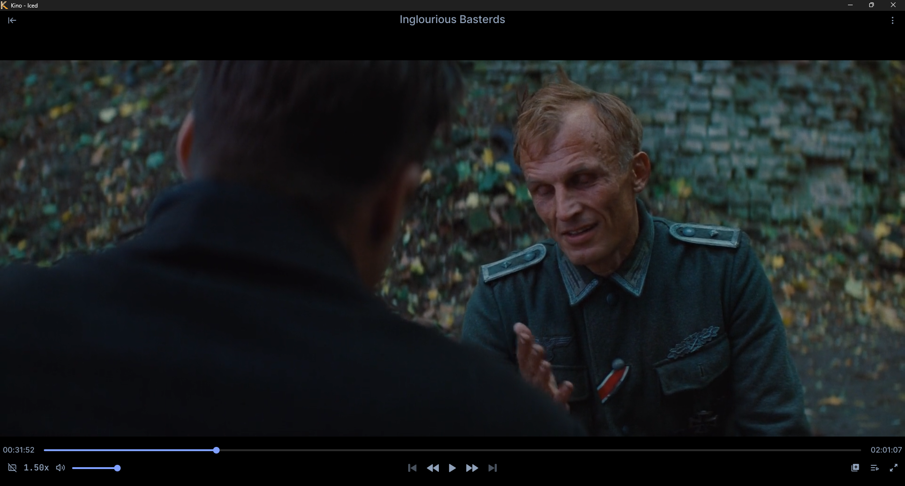

<div align="center">
    

# Kino

A local movie and TV show library manager and player with support for curated collections.





See the [showcase directory](resources/images/showcase) for more images.

</div>

## Features

- Scan and index any number of local directories for media files

- Fast search across your library with filtering and sorting options

- Fetch extra metadata using a user-supplied TMDB API key

- Fully customizable keybindings for actions throughout the app

- Create and customize collections, with support for pinning and hiding

- Theme support and configurable content layouts

Take a look at [the documentation](/resources/docs/README.md) for more.

## Roadmap

- [x] Automatic Collection populating

- [x] Selection mode for building playlists on the fly

- [x] Playlist saving

- [x] Comments on videos

- [x] Subtitle syncing

- [ ] Mini player mode

- [ ] Wishlist support

- [ ] Support for multiple metadata scrappers

- [ ] One-off video playback (without adding to library)

## Installation

Note that Kino relies on Gstreamer for video playback. You can install gstreamer by following the instructions [here](https://github.com/sdroege/gstreamer-rs?tab=readme-ov-file#installation)

### From Package

Pre-built packages for can be found on the [releases](https://github.com/EmmanuelDodoo/kino/releases) page

### With Cargo

```
cargo install --git https://github.com/EmmanuelDodoo/kino.git
```

### From Souce

```
git clone https://github.com/EmmanuelDodoo/kino.git
cd kino
cargo build --release
./target/release/kino
```

## Acknowledgement

Much thanks to

- [jazzfool](https://github.com/jazzfool) for both their work on [iced_video_player](https://github.com/jazzfool/iced_video_player) and [jangal](https://github.com/jazzfool/jangal) which provided some inspiration.

- [Iced](https://github.com/iced-rs/iced)

## Feedback

Feel free to leave any feedback via an issue or pull request.
